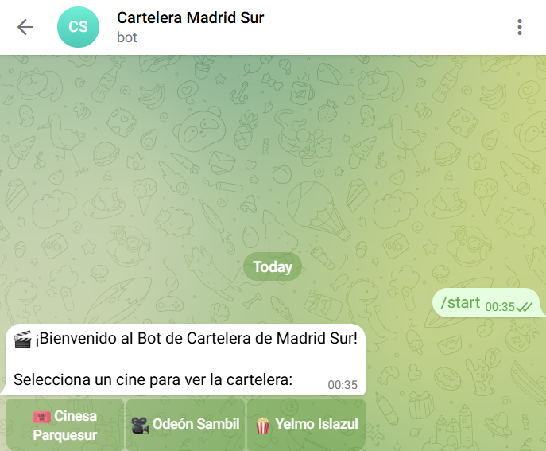
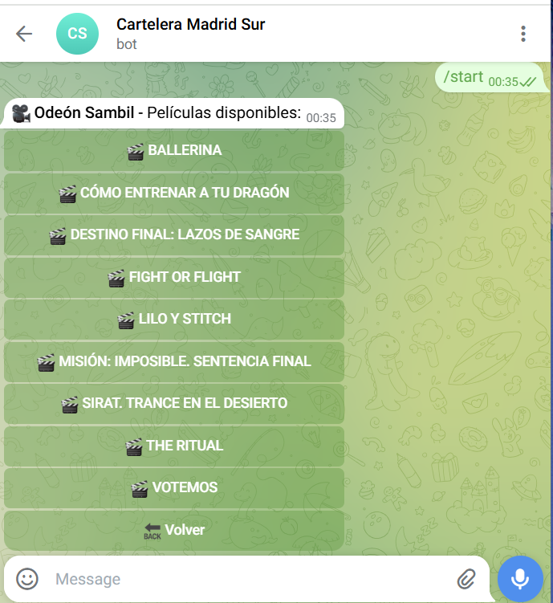
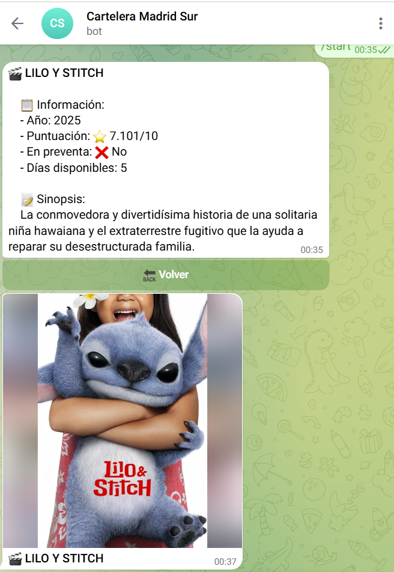
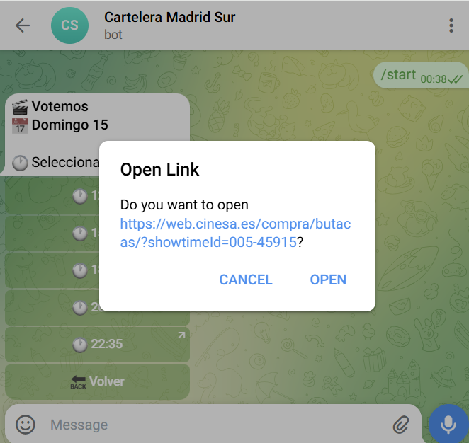

# 🎬 Cinema Bot Madrid Sur – Python Backend Portfolio Project

[](https://www.python.org/)
[](https://www.docker.com/)
[](https://core.telegram.org/bots/api)
[](https://railway.app/)

> **Backend Python para bot de Telegram con scraping híbrido (estático + dinámico), integración de APIs REST y despliegue containerizado.**

**Bot en producción:** [@cinema_sur_madrid_bot](https://t.me/cinema_sur_madrid_bot) | **Uptime:** 24/7 (Railway PaaS)

---

## 🖼️ Demo del Bot

<div align="center">

### Flujo completo de usuario con integración backend

| **1. Selección de cine** | **2. Cartelera scrapeada** | **3. Metadata desde TMDb API** |
|:---:|:---:|:---:|
|  |  |  |
| *Telegram Bot API + InlineKeyboardMarkup* | *Web scraping (BeautifulSoup/Playwright)* | *TMDb REST API + datos normalizados* |

### 4. Navegación hasta compra de entradas



**Stack técnico en acción:** Python async handlers → Scrapers híbridos → APIs externas → Respuesta a usuario en <3s

</div>

---

## 🎯 Enfoque técnico del proyecto

Este proyecto demuestra competencias clave en **desarrollo backend Python**:

### **Core Skills Demonstradas**

| Competencia | Implementación en el proyecto |
|-------------|-------------------------------|
| **Arquitectura de servicios** | Separación de responsabilidades: bot orchestrator, scrapers modulares, API clients |
| **Integración Telegram Bot API** | Gestión completa de webhooks, callback handlers, inline keyboards y estado de conversación |
| **Web scraping avanzado** | Híbrido estático (BeautifulSoup) + dinámico (Playwright) con manejo de JavaScript rendering |
| **Integración APIs REST** | Cliente TMDb para metadata + Telegram Bot API para mensajería |
| **Gestión de estado** | Context management para sesiones de usuario multi-cine (user_data persistence) |
| **Containerización** | Dockerfile optimizado con 20+ dependencias del sistema |
| **Async/await** | Operaciones asíncronas para scraping Playwright y handlers de Telegram |
| **Error handling** | Gestión de límites de API (64 bytes callback_data), timeouts y fallbacks |
| **CI/CD** | Deploy automático desde GitHub a Railway con Docker |

---

## 🏗️ Arquitectura Backend

```
┌─────────────────────────────────────────────────────────────┐
│                      TELEGRAM BOT API                        │
│                    (Webhook/Long Polling)                    │
└────────────────────────┬────────────────────────────────────┘
                         │
                         ▼
┌─────────────────────────────────────────────────────────────┐
│                    BOT ORCHESTRATOR                          │
│  ┌──────────────────────────────────────────────────────┐   │
│  │  • Command handlers (start, help)                    │   │
│  │  • Callback query routing                            │   │
│  │  • State management (context.user_data)              │   │
│  │  • Error handling & logging                          │   │
│  └──────────────────────────────────────────────────────┘   │
└────────┬────────────────────────┬────────────────────────────┘
         │                        │
         ▼                        ▼
┌─────────────────┐      ┌─────────────────────────┐
│  SCRAPER LAYER  │      │   EXTERNAL APIs         │
│                 │      │                         │
│ • BeautifulSoup │      │ • TMDb REST API         │
│ • Playwright    │      │ • Rate limiting         │
│ • Data cleaning │      │ • Response caching      │
│ • Normalization │      │ • Error fallbacks       │
└─────────────────┘      └─────────────────────────┘
         │                        │
         └────────────┬───────────┘
                      ▼
              ┌───────────────┐
              │  DATA MODELS  │
              │               │
              │ • Películas   │
              │ • Funciones   │
              │ • Horarios    │
              └───────────────┘
```

---

## 💻 Stack Tecnológico

### **Backend Core**
- **Python 3.11** – Type hints, async/await, context managers
- **python-telegram-bot 20.7** – Framework asíncrono para Telegram Bot API
  - CommandHandler para `/start`
  - CallbackQueryHandler para navegación inline
  - Context.user_data para persistencia de sesión
- **asyncio** – Concurrencia para I/O-bound operations

### **Web Scraping**
- **requests + BeautifulSoup4** – Scraping estático (HTML puro)
- **Playwright + Chromium** – Scraping dinámico (JavaScript-heavy sites)
- **Regex** – Normalización y limpieza de datos

### **APIs & Integration**
- **Telegram Bot API** – Long polling, inline keyboards, callback queries
- **TMDb REST API** – Metadatos de películas (JSON)
- **HTTP headers customization** – Anti-bot detection bypass para scrapers

### **DevOps & Infrastructure**
- **Docker** – Containerización con dependencias del sistema
- **Railway PaaS** – CI/CD automático desde GitHub
- **python-dotenv** – Gestión de secrets y configuración

---

## 🔧 Desafíos Técnicos Resueltos

### **1. Web Scraping Dinámico**

**Problema:** El sitio de Odeón Sambil renderiza contenido vía JavaScript, imposible de scrapear con `requests`.

**Solución implementada:**
```python
async def get_odeon_showtimes():
    async with async_playwright() as p:
        browser = await p.chromium.launch(headless=True)
        page = await browser.new_page()
        
        # Esperar renderizado JavaScript
        await page.goto(URL_ODEON, timeout=30000)
        await page.wait_for_selector("div.sessions", timeout=10000)
        await page.wait_for_timeout(2000)  # Asegurar JS completo
        
        html = await page.content()
        await browser.close()
    
    # Procesar HTML renderizado con BeautifulSoup
    soup = BeautifulSoup(html, "html.parser")
    # ...
```

**Trade-offs considerados:**
- ✅ **Pros:** Datos siempre actualizados, bypass de JS rendering
- ⚠️ **Cons:** Mayor consumo de recursos (Chromium), latencia adicional (~3s)
- 🎯 **Decisión:** Híbrido – usar Playwright solo donde sea necesario

---

### **2. Gestión de Dependencias del Sistema en Docker**

**Problema:** Playwright requiere 20+ librerías del sistema (libnss3, libgbm1, etc.) que no vienen en Python base.

**Solución – Dockerfile optimizado:**
```dockerfile
FROM python:3.11-slim

# Instalar dependencias del sistema (una sola layer)
RUN apt-get update && apt-get install -y \
    wget gnupg libglib2.0-0 libnss3 libnspr4 libdbus-1-3 \
    libatk1.0-0 libatk-bridge2.0-0 libcups2 libdrm2 libxcb1 \
    libxkbcommon0 libatspi2.0-0 libx11-6 libxcomposite1 \
    libxdamage1 libxext6 libxfixes3 libxrandr2 libgbm1 \
    libpango-1.0-0 libcairo2 libasound2 \
    && rm -rf /var/lib/apt/lists/*  # Reducir tamaño

WORKDIR /app
COPY requirements.txt .
RUN pip install --no-cache-dir -r requirements.txt
RUN playwright install chromium

COPY . .
CMD ["python", "bot.py"]
```

**Resultado:**
- Imagen final: ~650MB (vs ~1.2GB sin optimización)
- Build time: 8 min (vs 15 min sin caché)

---

### **3. Límites de API de Telegram**

**Problema:** `Button_data_invalid` – Telegram limita `callback_data` a 64 bytes.

**Análisis del problema:**
```python
# ❌ Esto falla con títulos largos
callback_data = f"pelicula_{titulo_completo}"  
# Ejemplo: "pelicula_Sonic 3: La película (Preventa IMAX)" = 50+ bytes
```

**Solución – Sistema de índices:**
```python
# Mapeo título → índice corto
titulos_lista = list(peliculas.keys())
context.user_data['titulos_lista'] = titulos_lista

keyboard = [
    [InlineKeyboardButton(
        titulo, 
        callback_data=f"peli_{idx}"  # Máx: "peli_999" = 8 bytes
    )]
    for idx, titulo in enumerate(titulos_lista)
]

# Recuperación en callback handler
async def handle_movie_selection(update, context):
    idx = int(query.data.replace("peli_", ""))
    titulo = context.user_data['titulos_lista'][idx]
```

**Ventajas:**
- ✅ Cumple límite de API garantizado
- ✅ Escalable a miles de películas
- ✅ State management eficiente

---

### **4. Normalización de Datos de Scraping**

**Problema:** Cada cine devuelve formatos diferentes para fechas y horarios.

**Ejemplo de datos crudos:**
```
Cinesa:   "Hoy, viernes" + "16:00ATMOS"
Odeón:    "Viernes 22 de octubre" + "16:00\nATMOS DIGITAL"
Yelmo:    "Mañana, sábado 23" + "16:00"
```

**Solución – Normalización con regex:**
```python
import re

# Limpiar prefijos temporales
RE_PREFIX = re.compile(r"^(hoy|mañana)\s*,?\s*", re.IGNORECASE)

def dia_normalizado(fila: Tag) -> str:
    wday_raw = fila.select_one("span.wday").get_text(strip=True)
    wday_clean = RE_PREFIX.sub("", wday_raw).strip()
    
    mday = fila.select_one("span.mday")
    if mday:
        fecha_completa = mday.get_text(strip=True)
        return f"{wday_clean} {fecha_completa}"
    return wday_clean

# Limpiar horarios
hora_texto = re.sub(r'(ATMOS|DIGITAL|DOLBY|VIP|3D|4D)$', '', hora_raw).strip()
```

**Output unificado:**
```json
{
  "titulo": "Sonic 3",
  "funciones": [
    {
      "dia": "Viernes 22 de octubre",
      "horarios": [
        {"hora": "16:00", "url": "https://..."}
      ]
    }
  ]
}
```

---

## 📂 Estructura del Código

```
cinema-bot-madrid/
├── bot.py              # Orchestrator principal (handlers, routing)
│   ├── start()         # Command handler /start
│   ├── handle_button_click()  # Callback router por cine
│   ├── handle_movie_selection()  # Gestión de índices
│   └── main()          # Application builder + polling
│
├── scrapers.py         # Capa de extracción de datos
│   ├── get_cinesa_showtimes()   # BeautifulSoup
│   ├── get_yelmo_showtimes()    # BeautifulSoup
│   ├── get_odeon_showtimes()    # Playwright (async)
│   └── dia_normalizado()        # Helpers de limpieza
│
├── tmdb_api.py         # Cliente REST para TMDb
│   ├── buscar_pelicula()        # Search endpoint
│   └── obtener_url_cartel()     # Image URL builder
│
├── Dockerfile          # Container definition
├── requirements.txt    # Dependencias Python
├── .env.example        # Template de configuración
└── TROUBLESHOOTING.md  # Resolución de problemas técnicos
```

---

## 🚀 Setup Local

### **Prerequisitos**
- Python 3.11+
- Docker (opcional, recomendado)
- Credenciales: Telegram Bot Token + TMDb API Key

### **Opción 1: Con Docker (recomendado)**

```bash
# Clonar repo
git clone https://github.com/pablolaya-dev/bot-cinema-madrid-sur.git
cd bot-cinema-madrid-sur

# Configurar variables de entorno
cp .env.example .env
# Editar .env con tus credenciales

# Build & run
docker build -t cinema-bot .
docker run --env-file .env cinema-bot
```

### **Opción 2: Local (desarrollo)**

```bash
# Crear entorno virtual
python -m venv .venv
source .venv/bin/activate  # Linux/Mac
.venv\Scripts\activate     # Windows

# Instalar dependencias
pip install -r requirements.txt

# Instalar Playwright + Chromium
playwright install chromium

# Configurar .env (igual que opción 1)

# Ejecutar
python bot.py
```

---

## 🧪 Testing

### **Test manual de scrapers**
```bash
python scrapers.py
```

**Output esperado:**
```python
=== CINESA ===
[{'titulo': 'Sonic 3: La película',
  'preventas': False,
  'funciones': [{'dia': 'Viernes 22 de octubre',
                 'horarios': [{'hora': '16:00', 'url': '...'}]}]}]
```

### **Test de integración completa**
```bash
# Variables en .env configuradas
python -c "
from bot import main
from scrapers import get_cinesa_showtimes
from tmdb_api import buscar_pelicula

# Test scrapers
assert len(get_cinesa_showtimes()) > 0

# Test API
pelicula = buscar_pelicula('Sonic 3')
assert pelicula is not None

print('✅ Todos los tests pasaron')
"
```

---

## 📊 Métricas de Producción

| Métrica | Valor |
|---------|-------|
| **Uptime** | ~99% (Railway Hobby Plan con hibernación) |
| **Response time** | 2-4s (scraping incluido) |
| **Build time (Docker)** | ~8 minutos |
| **Tamaño de imagen** | ~650MB |
| **Memoria en runtime** | ~180MB |
| **Cines integrados** | 3 (Cinesa, Odeón, Yelmo) |
| **Deploy method** | Automático (GitHub → Railway) |

---

## 🔐 Gestión de Secrets

### **Variables de entorno requeridas:**

```bash
# .env (local)
TELEGRAM_BOT_TOKEN=123456789:ABCdefGHIjklMNOpqrsTUVwxyz
TMDB_API_KEY=abcd1234efgh5678ijkl9012mnop3456
ENVIRONMENT=development
LOG_LEVEL=INFO
```

### **Railway (producción):**
Settings → Variables → Añadir manualmente (Railway NO lee `.env`)

### **Seguridad:**
- ✅ `.env` en `.gitignore`
- ✅ Tokens nunca en código fuente
- ✅ Uso de `python-dotenv` para carga segura
- ✅ Variables separadas por entorno (dev/prod)

---

## 🐛 Debugging & Troubleshooting

### **Logs estructurados:**
```python
import logging

logging.basicConfig(
    level=logging.INFO,
    format='%(asctime)s - %(name)s - %(levelname)s - %(message)s'
)

logger = logging.getLogger(__name__)
logger.info(f"Usuario {user_id} solicitó cine: {cine}")
```

### **Errores comunes:**

| Error | Causa | Solución |
|-------|-------|----------|
| `Button_data_invalid` | callback_data > 64 bytes | Sistema de índices (ver código) |
| `Conflict: terminated by other getUpdates` | Múltiples instancias activas | Detener instancia local |
| `Browser not found` | Playwright sin instalar | `playwright install chromium` |
| `403 Forbidden` | Scraper bloqueado | Custom headers (ver scrapers.py) |

**Documentación completa:** [TROUBLESHOOTING.md](TROUBLESHOOTING.md)

---

## 🎓 Aprendizajes Técnicos Clave

### **1. Trade-offs en arquitectura**
- **Scraping estático vs dinámico:** elegir herramienta según necesidad real
- **Polling vs webhooks:** polling más simple para tier gratuito, webhooks mejor para producción
- **Monolito vs microservicios:** monolito justificado para proyectos pequeños

### **2. Optimización de recursos**
- **Docker multi-stage builds** reducen tamaño de imagen 40%
- **Caché de APT/pip** acelera builds subsecuentes
- **Async/await** crítico para scrapers I/O-bound

### **3. Gestión de dependencias complejas**
- Playwright = dependencias Python + sistema operativo
- Solución: containerización con control total del entorno
- Alternativa descartada: buildpacks (dependencias inconsistentes)

### **4. Debugging en producción**
- **Logs estructurados** esenciales sin acceso SSH
- **Railway logs** en tiempo real para diagnóstico rápido
- **Health checks** personalizados en `/health` endpoint

---

## 📈 Roadmap Técnico

### **Implementado**
- ✅ Scraping híbrido (estático + dinámico)
- ✅ API REST integration (TMDb)
- ✅ Containerización Docker
- ✅ CI/CD automático (Railway)
- ✅ State management (user context)


---

## 👨‍💻 Sobre el Desarrollador

**Pablo Laya**  
Estudiante de DAM/DAW | Backend Python Developer  
Madrid, España

### **Competencias Técnicas**

**Backend:**
- Python (asyncio, type hints, dataclasses)
- REST APIs (requests, httpx)
- Web scraping (BeautifulSoup, Playwright, Scrapy)
- Docker & containerización

**Bases de datos:**
- SQL (PostgreSQL, MySQL)
- ORM (SQLAlchemy)

**DevOps:**
- CI/CD (GitHub Actions, Railway)
- Linux (bash scripting, systemd)
- Git (branching, rebasing, hooks)

### **Enfoque de Aprendizaje**

Este proyecto representa mi **metodología de aprendizaje autodidacta**:
1. **Problema real** → Bot funcional que uso personalmente
2. **Research técnico** → Evaluar alternativas (Selenium vs Playwright)
3. **Implementación iterativa** → MVP → refactor → optimización
4. **Documentación exhaustiva** → README + troubleshooting guide
5. **Asistencia de IA** → ChatGPT/Claude como pair-programming mentor


---

## 🔗 Enlaces

- **Repositorio:** [github.com/Prodelaya/bot-cinema-madrid-sur](https://github.com/Prodelaya/bot-cinema-madrid-sur)
- **Bot en Telegram:** [@cinema_sur_madrid_bot](https://t.me/cinema_sur_madrid_bot)
- **GitHub:** [github.com/Prodelaya](https://github.com/Prodelaya)
- **Email:** proyectos.delaya@gmail.com

---

## 📄 Licencia

MIT License - Ver [LICENSE](LICENSE) para detalles

---

## 💡 ¿Preguntas sobre la implementación?

**Backend Python:**
- ¿Por qué elegiste Playwright sobre Selenium? → [Ver decisión técnica](#1-web-scraping-dinámico)
- ¿Cómo escalas los scrapers? → [Ver roadmap](#roadmap-técnico)
- ¿Gestión de errores en producción? → [Ver troubleshooting](TROUBLESHOOTING.md)

**Para reclutadores:**
Este proyecto demuestra:
- ✅ Capacidad para arquitecturar soluciones backend completas
- ✅ Resolución de problemas técnicos complejos (scraping dinámico, containerización)
- ✅ Autonomía en aprendizaje de nuevas tecnologías
- ✅ Pensamiento crítico en trade-offs técnicos
- ✅ Documentación clara de decisiones de diseño

**Contacto:** proyectos.delaya@gmail.com
